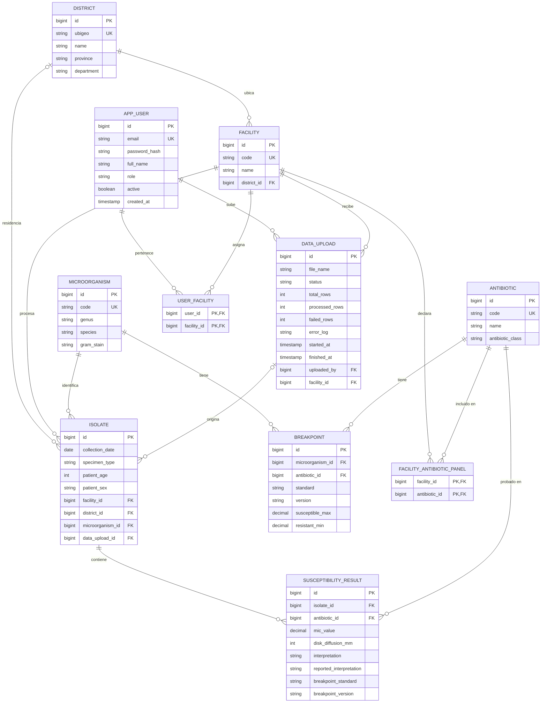

# Atlas RAM

**Plataforma de antibiogramas acumulados para una terapia antibiótica empírica informada**

| | |
|---|---|
| **Curso** | CS 2031 Desarrollo Basado en Plataforma |
| **Universidad** | Universidad de Ingeniería y Tecnología (UTEC), 2026-2 |
| **Integrantes** | Álvaro Felipe Quispe Carrillo · Joaquim Alexander Carrión Díaz · Fabian Isaias Sanchez Zedano · Adriano Alonso Cosme Salazar |
| **API desplegada** | `http://3.85.201.152:8080/api/v1` |

---

## Índice

- [Introducción](#introducción)
- [Identificación del problema](#identificación-del-problema)
- [Descripción de la solución](#descripción-de-la-solución)
- [Modelo de entidades](#modelo-de-entidades)
- [Manejo de errores](#manejo-de-errores)
- [Medidas de seguridad](#medidas-de-seguridad)
- [Eventos y asincronía](#eventos-y-asincronía)
- [Despliegue](#despliegue)
- [Ejecución local](#ejecución-local)
- [GitHub y gestión del proyecto](#github-y-gestión-del-proyecto)
- [Conclusión](#conclusión)
- [Apéndices](#apéndices)

---

## Introducción

### Contexto

La resistencia antimicrobiana es una de las principales amenazas de salud pública según la Organización Mundial de la Salud. Cuando un paciente llega con una infección grave, el médico no puede esperar los dos o tres días que tarda el cultivo: tiene que elegir un antibiótico de inmediato. Esa elección, llamada **terapia empírica**, se apoya en el **antibiograma acumulado**, un resumen de qué porcentaje de las bacterias aisladas en una institución o región resiste a cada antibiótico.

En el Perú, los laboratorios generan estos datos a diario, pero quedan dispersos en hojas de cálculo y exportaciones de WHONET que rara vez se consolidan. Los antibiogramas acumulados, cuando existen, se publican una vez al año y en PDF.

### Objetivos

- Centralizar los resultados de susceptibilidad de múltiples laboratorios en un solo sistema.
- Interpretar cada concentración mínima inhibitoria (CIM) contra puntos de corte versionados, de forma trazable.
- Calcular antibiogramas acumulados filtrables por microorganismo, distrito y período, respetando el umbral mínimo de la guía CLSI M39.
- Procesar cargas masivas de forma asíncrona y alertar cuando una combinación supera un umbral de resistencia.
- Proteger el acceso según el rol de cada usuario.

---

## Identificación del problema

### Descripción

Un laboratorio clínico reporta, para cada aislamiento bacteriano, la CIM de cada antibiótico probado y su interpretación: sensible, intermedio o resistente. Esa interpretación depende de un **punto de corte** publicado por comités como el CLSI, que se revisa cada año. En 2019, por ejemplo, el CLSI redujo el punto de corte de ciprofloxacino para enterobacterias: resultados que antes eran sensibles pasaron a ser resistentes sin que la bacteria cambiara.

Si un sistema solo guarda la interpretación final, pierde la capacidad de explicar por qué un resultado dice lo que dice, y una serie histórica deja de ser comparable. Si además los datos no se agregan, el médico decide a ciegas.

### Justificación

Una terapia empírica mal elegida retrasa el tratamiento efectivo y selecciona más resistencia. Contar con datos locales, actualizados y trazables es la base de cualquier programa de optimización de antimicrobianos. El problema no es la falta de datos, sino su fragmentación.

---

## Descripción de la solución

### Funcionalidades implementadas

**Carga masiva asíncrona.** Un técnico sube un archivo CSV con los resultados de su laboratorio. El servidor responde `202 Accepted` de inmediato y procesa el archivo en segundo plano. Cada fila con errores se registra sin abortar la carga completa, y el usuario consulta el progreso en cualquier momento.

**Interpretación trazable.** Cada resultado conserva la CIM cruda, la interpretación que reportó el laboratorio y la que calcula el sistema, junto con el estándar y la versión del punto de corte aplicado. Esto permite reinterpretar el histórico cuando cambie la norma.

**Antibiograma acumulado.** Una consulta agregada calcula el porcentaje de resistencia por combinación de microorganismo y antibiótico, con filtros opcionales. Las combinaciones con menos de 30 aislamientos se omiten, como recomienda CLSI M39, lo que además reduce el riesgo de reidentificar pacientes en grupos pequeños.

**Alertas de resistencia.** Tras cada carga, el sistema revisa el antibiograma del establecimiento y notifica cuando una combinación supera el umbral configurado.

**Control de acceso por rol.** Administradores, técnicos de laboratorio, epidemiólogos y usuarios públicos tienen permisos distintos.

### Tecnologías utilizadas

| Categoría | Tecnología |
|---|---|
| Lenguaje | Java 21 |
| Framework | Spring Boot 3.5.6 (Web, Data JPA, Security, Validation, Mail) |
| Persistencia | Hibernate 6.6, PostgreSQL 16 |
| Autenticación | JWT con jjwt 0.12.6, BCrypt |
| Utilidades | Lombok |
| Infraestructura | Docker Compose (desarrollo), AWS EC2 y RDS (producción) |
| Integración continua | GitHub Actions |

### Arquitectura

```mermaid
flowchart LR
    C[Cliente] -->|HTTP + JWT| F[JwtAuthenticationFilter]
    F --> CT[Controllers]
    CT --> S[Services]
    S --> R[Repositories]
    R --> DB[(PostgreSQL)]
    S -->|publica| E[Eventos]
    E -->|@Async| L[Listeners]
    L --> M[MailService]
```

El código sigue una arquitectura en capas: los controladores reciben la petición y delegan en los servicios, que contienen la lógica de negocio y acceden a los datos mediante repositorios de Spring Data. Las entidades nunca se exponen: toda entrada y salida pasa por DTOs y mappers.

---

## Modelo de entidades



### Descripción de entidades

| Entidad | Propósito |
|---|---|
| `District` | Distritos con su ubigeo del INEI. |
| `Facility` | Establecimientos de salud, cada uno en un distrito. |
| `Microorganism` | Catálogo de microorganismos con código WHONET y tinción de Gram. |
| `Antibiotic` | Catálogo de antibióticos con código WHONET y familia. |
| `User` | Usuarios con correo, contraseña cifrada y rol. |
| `Isolate` | Un aislamiento bacteriano: fecha, tipo de muestra, microorganismo y establecimiento. |
| `SusceptibilityResult` | La CIM de un antibiótico sobre un aislamiento y su interpretación. |
| `Breakpoint` | Puntos de corte por microorganismo, antibiótico, estándar y versión. |
| `DataUpload` | Registro de cada carga masiva con su estado y errores. |

Se usan los cuatro tipos de relación de JPA. Todos los `@ManyToOne` son `LAZY` para evitar consultas N+1. La relación entre `Isolate` y `SusceptibilityResult` es bidireccional con `cascade = ALL` y `orphanRemoval`, porque un resultado no existe fuera de su aislamiento. Las relaciones hacia catálogos son unidireccionales, porque nadie necesita cargar todos los aislamientos de un distrito.

### Decisiones de diseño

- **Sin identificador de paciente.** El modelo no guarda nombre ni documento: la anonimización está en el diseño, no en una promesa.
- **CIM en `BigDecimal`.** La comparación contra puntos de corte exige aritmética exacta.
- **Puntos de corte versionados.** La restricción única combina microorganismo, antibiótico, estándar y versión, de modo que conviven varias versiones del CLSI.
- **Restricciones con nombre explícito.** `uk_isolate_antibiotic` impide duplicar un antibiótico en un aislamiento, y su nombre es el contrato con el manejador de errores.
- **Distrito de agregación.** La procedencia del paciente es opcional. Si falta, un campo calculado usa el distrito del establecimiento, sin copiarlo al guardar, para no confundir un dato real con uno inferido.

---

## Manejo de errores

La API centraliza el manejo de errores en un `@ControllerAdvice`, de modo que ninguna excepción llega al cliente como una traza de Java. Toda respuesta de error comparte el mismo formato:

```json
{
  "timestamp": "2026-09-22T08:30:00Z",
  "status": 404,
  "error": "Not Found",
  "message": "Establecimiento no encontrado: 99",
  "path": "/api/v1/facilities/99"
}
```

Se definieron ocho excepciones personalizadas, y el manejador traduce cada una a un código HTTP:

| Excepción | Código | Cuándo ocurre |
|---|---|---|
| `ResourceNotFoundException` | 404 | el recurso solicitado no existe |
| `DuplicateResourceException` | 409 | se intenta crear un registro que ya existe |
| `UploadNotRevertableException` | 409 | se intenta revertir una carga que no está completada |
| `InvalidCredentialsException` | 401 | correo o contraseña incorrectos |
| `InvalidTokenException` | 401 | token ausente, expirado o mal firmado |
| `BusinessRuleException` | 422 | la petición es válida pero viola una regla del dominio |
| `BreakpointNotFoundException` | 422 | no hay punto de corte para interpretar un resultado |
| `InvalidCsvFormatException` | 400 | el archivo de carga no tiene el formato esperado |

El manejador también captura las excepciones propias de Spring: `MethodArgumentNotValidException` y `HttpMessageNotReadableException` responden `400`, y `DataIntegrityViolationException` responde `409` cuando se viola una restricción de la base. Cualquier otra excepción responde `500` con un mensaje genérico y se registra en el log, sin exponer la traza al cliente.

Manejar los errores de forma global garantiza respuestas consistentes para el cliente, evita filtrar detalles internos y concentra la lógica en un solo lugar.

---

## Medidas de seguridad

### Seguridad de datos

- **Autenticación sin estado con JWT.** El login entrega un token de acceso de una hora y un token de renovación. Un filtro valida el token en cada petición y carga el usuario en el contexto de seguridad.
- **Contraseñas con BCrypt.** Nunca se almacena ni se devuelve la contraseña en texto plano.
- **Cuatro roles.** `ADMIN`, `LAB_TECHNICIAN`, `EPIDEMIOLOGIST` y `PUBLIC_VIEWER`, guardados en la base y en el token. Los métodos sensibles se protegen con `@PreAuthorize`.
- **Registro con permisos mínimos.** Todo usuario nuevo se crea como `PUBLIC_VIEWER`; solo un administrador puede elevar su rol.
- **Secretos fuera del código.** La clave JWT y las credenciales se leen de variables de entorno. El archivo `.env` está excluido del repositorio.
- **Datos anonimizados por diseño**, como se explicó en el modelo.

### Prevención de vulnerabilidades

- **Inyección SQL:** todas las consultas usan JPA con parámetros enlazados; no se concatena SQL.
- **XSS:** la API solo devuelve JSON y no renderiza HTML con datos de usuario.
- **CSRF:** la protección se desactiva de forma deliberada porque la API es sin estado y no usa cookies de sesión.
- **CORS:** configurado en Spring Security para controlar qué orígenes pueden llamar a la API desde un navegador.
- **Validación de entrada:** Bean Validation en todos los DTOs de entrada.

**Limitación conocida:** los tokens de renovación no se persisten, así que no pueden revocarse antes de expirar (ver issue #4).

---

## Eventos y asincronía

La ingesta de un archivo con miles de filas puede tardar. Si se procesara dentro de la petición HTTP, el cliente quedaría bloqueado y la conexión podría expirar. Por eso el endpoint de carga responde `202 Accepted` y delega el trabajo.

| Evento | Se publica cuando | Efecto |
|---|---|---|
| `UploadCompletedEvent` | una carga termina | correo al usuario con el resumen |
| `UploadFailedEvent` | una carga falla | correo al usuario con el motivo |
| `ResistanceAlertEvent` | una combinación supera el umbral | correo a epidemiología |

Los listeners usan `@TransactionalEventListener`, que espera a que la transacción se confirme antes de ejecutarse: así no se notifica una carga que luego se revierte. Los eventos llevan solo datos planos, nunca entidades, porque el listener corre en otro hilo fuera de la transacción.

Se configuran dos `ThreadPoolTaskExecutor` separados: uno para la ingesta y otro para las notificaciones. Si compartieran hilos, una carga larga retrasaría todos los correos.

---

## Despliegue

La API está desplegada en AWS en `http://3.85.201.152:8080/api/v1`.

| Componente | Configuración |
|---|---|
| Aplicación | EC2 `t3.micro`, Amazon Linux 2023, Java 21, servicio `systemd` |
| Base de datos | RDS PostgreSQL 16, `db.t4g.micro`, conexión cifrada |
| Red | La base solo acepta conexiones desde el grupo de seguridad del servidor |
| Configuración | Variables de entorno en el servidor, fuera del repositorio |

Prueba rápida: `GET http://3.85.201.152:8080/api/v1/districts`

---

## Ejecución local

**Requisitos:** Java 21, Docker Desktop.

```bash
git clone https://github.com/alvaroquispec-code/atlas-ram-backend.git
cd atlas-ram-backend
cp .env.example .env          # completar contraseñas y JWT_SECRET
docker compose up -d          # PostgreSQL en el puerto 5433
export JWT_SECRET=...         # Spring no lee el .env: la variable debe estar en el entorno
./mvnw spring-boot:run        # crea las tablas
docker cp db/seed/data.sql atlasram-db:/tmp/data.sql
docker exec atlasram-db psql -U atlasram -d atlasram -f /tmp/data.sql
```

### Variables de entorno

| Variable | Descripción |
|---|---|
| `SPRING_DATASOURCE_URL` | URL JDBC de la base |
| `SPRING_DATASOURCE_USERNAME` | usuario de la base |
| `SPRING_DATASOURCE_PASSWORD` | contraseña de la base |
| `JWT_SECRET` | clave de firma en base64, mínimo 64 bytes |
| `JWT_EXPIRATION_MS` | vigencia del token de acceso |
| `MAIL_ENABLED` | activa el envío real de correos |
| `MAIL_HOST`, `MAIL_USERNAME`, `MAIL_PASSWORD` | servidor SMTP |

### Endpoints principales

Todos bajo `/api/v1`. La documentación completa está en `postman_collection.json`.

| Método | Ruta | Acceso |
|---|---|---|
| `POST` | `/auth/register` | público |
| `POST` | `/auth/login` | público |
| `GET` | `/districts`, `/microorganisms`, `/antibiotics`, `/facilities` | público |
| `GET` | `/antibiogram` | público |
| `GET` | `/isolates` | autenticado |
| `POST` | `/uploads` | técnico o administrador |
| `GET` | `/uploads/{id}` | autenticado |

Usuarios de prueba del seed: `admin@atlasram.test`, contraseña `AtlasRam2026!`.

---

## GitHub y gestión del proyecto

El trabajo se dividió en cuatro módulos: dominio, seguridad, API y errores, y asincronía con despliegue. Cada integrante trabajó en ramas con prefijo `feat/`, `fix/`, `chore/` o `docs/`, que se integraron en `develop` mediante pull requests revisados por otro integrante. La rama `main` recibe solo versiones estables.

Los commits siguen la convención *Conventional Commits*. Las tareas pendientes y las limitaciones conocidas se registran como issues, organizados con labels por módulo y un milestone para la entrega de la semana 7.

GitHub Actions compila el proyecto en cada push y pull request, y verifica que no se suban archivos de secretos.

---

## Conclusión

### Logros

Atlas RAM convierte resultados dispersos de laboratorio en antibiogramas consultables, con una interpretación trazable a la versión del estándar clínico aplicado. El sistema procesa cargas masivas sin bloquear al usuario, alerta sobre resistencias elevadas y está desplegado y accesible públicamente.

### Aprendizajes clave

Aprendimos que las decisiones de modelado tienen consecuencias clínicas: guardar la CIM cruda en lugar de solo la interpretación es lo que hace posible reinterpretar datos históricos. También que la asincronía exige cuidado con las transacciones, y que coordinar cuatro módulos obliga a acordar contratos, como el nombre de una restricción, antes de escribir código.

### Trabajo futuro

- Persistir los tokens de renovación para permitir su revocación (#4).
- Validar los antibióticos reportados contra el panel declarado de cada establecimiento (#1).
- Umbrales de alerta por combinación de microorganismo y antibiótico.
- Procesamiento por lotes para archivos muy grandes.
- Reinterpretación masiva del histórico cuando se publique un nuevo estándar.

---

## Apéndices

### Datos de prueba

Los datos del seed son **sintéticos**. Los catálogos usan nomenclatura real (códigos WHONET, ubigeo del INEI), y las tasas de resistencia están calibradas con estudios peruanos publicados. No corresponden a pacientes reales. El detalle está en `db/seed/CALIBRACION.md`.

### Licencia

MIT.

### Referencias

1. Clinical and Laboratory Standards Institute. *M100: Performance Standards for Antimicrobial Susceptibility Testing*.
2. Clinical and Laboratory Standards Institute. *M39: Analysis and Presentation of Cumulative Antimicrobial Susceptibility Test Data*.
3. Organización Mundial de la Salud. *Global Antimicrobial Resistance and Use Surveillance System (GLASS)*.
4. Levy-Blitchtein S. et al. *Emergence and spread of carbapenem-resistant Acinetobacter baumannii in Lima, Peru*. Emerging Microbes & Infections, 2018.
5. Krapp F. et al. *Carbapenem-resistant Klebsiella pneumoniae in a tertiary hospital in Lima*. Microbiology Spectrum, 2025.
6. Montañez-Valverde R. et al. *Resistencia de Escherichia coli a ciprofloxacino*. Anales de la Facultad de Medicina, UNMSM, 2015.
7. Ley N.º 29733, Ley de Protección de Datos Personales del Perú.
